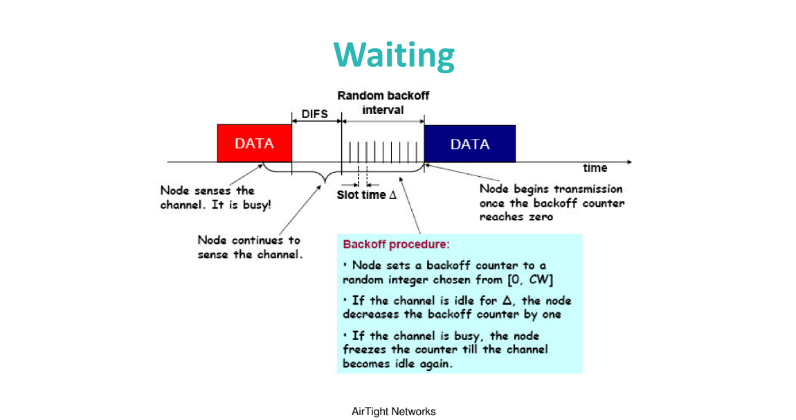

# Project01 CSMA/CA simulation
We use Mento-Carlo simulation to demonstrate the average transmission efficiency versus the number of STAs in a BSS, where 

$$
\text{Transmission Efficiency} = \frac{\text{Time for Frame Transmission and Acknowledge}}{\text{Time for Frame Transmission+Overhead(SIFS,DIFS,contention)}}.
$$

1. We assume all the STAs always have data for transmission. \\
2. Given a fixed number of STAs, more than 1000 transmissions are generated to measure the average transmission efficiency. \\
3. We show the transmission efficiency versus number of STAs. \\

