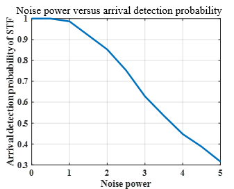

# Project02 STF and LTF
We use simulations to show the arrival detection performance of short training field (STF), and synchronization performance of long training field (LTF).

1.	Given a SNR level, we try sufficient times to measure the arrival detection probability of STF. The curve of arrival detection probability versus the SNR level is shown as follows.

2.	Given a SNR level, we try sufficient times to measure the synchronization error distribution of LTF in an AWGN channel with multipath effect. There are one main path and one side path with 60% intensity and 12 units delay. The curve of error variance versus the SNR level is shown as follows.

