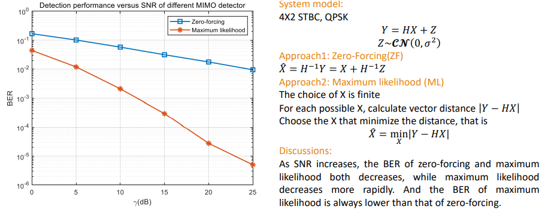

# Project03 MIMO in WiFi
1.	We use one example (all ‘1’ sequence) to show how to scramble and de-scramble a sequence in IEEE 802.11.

2.	We show the detection procedure of Space-Time Block Code (STBC) with $N_{STS}=4$ and $N_{SS}=2$. We randomly generate channel for sufficient times at each SNR level, and compared two decoders, zero-forcing (ZF) and maximum likelyhood(ML). The detection error probability versus SNR is shown in the figure below. 

