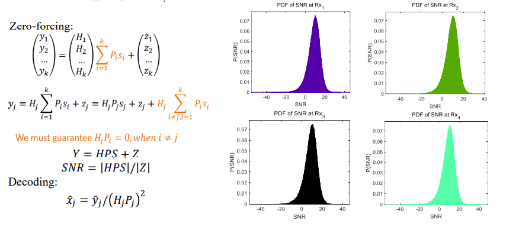

# Project04 Downlink Zero-Forcing Beamforming

We Consider downlink MU-MIMO transmission with one AP and 4 single-antenna receiver, where the AP has 4 antennas. Given a noise power, we randomly generate more than 1000 channel matrices. For each channel matrix, we use zero-forcing principle to design the downlink precoder. We show the distribution of SNR at the 4 receivers.

