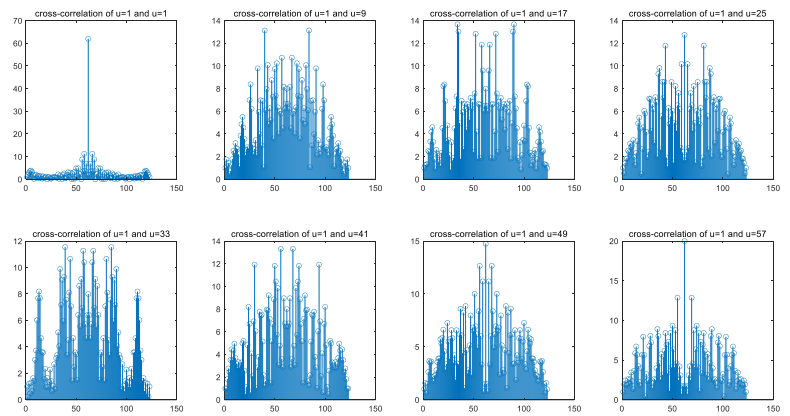
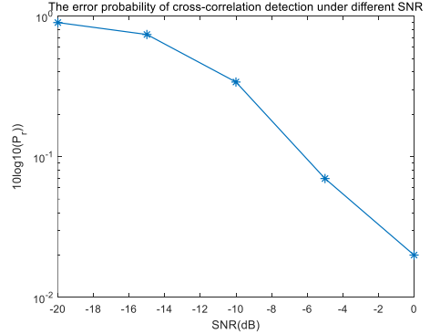

# Project06 Random Access of PRACH

1. We generate a number of preambles for PRACH, and show the feasibility of cross-correlation detection. The following are some examples of cross-correlation of 
preamble sequences with u equals 1 and others.

2. We show the feasibility of cross-correlation detection in AWGN channel. We count the error probability of cross-correlation detection under different SNR, which is illustrated in the figure below.

