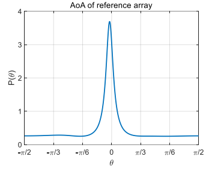
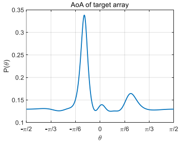
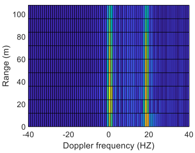

# Project07 Intergrated Communication and Sensing

We use the data collected from two arrays (Target Array and Reference Array, totally 12 antenna elements) to detect the following information:
1. Detect the main angles of arrival (AoAs) of each antenna array. 
 

2. Direct the receiving beam to the running person. Show the Doppler frequency of his scattering path and his position versus time. 

